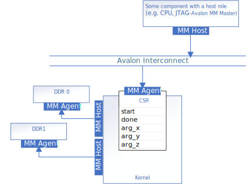

# Memory-Mapped Host Interfaces
This implementation uses a register-mapped invocation interface, and demonstrates how to use `annotated_arg` to customize the memory-mapped host data interface.



## Invocation Interface
By default, an un-decorated oneAPI kernel will have all its control signals and arguments mapped into the IP component's control/status register (CSR).

## Data Interface - MM Host
The pointer arguments `a_in`, `b_in`, `c_out` and scalar argument `len` are passed through the IP component's CSR. In this example design, the memory-mapped host interfaces pointed to by `a_in`, `b_in`, `c_out` are customized using `annotated_arg`.

You can customize memory-mapped interfaces of your IP component if the component uses a unified shared memory (USM) host pointer to access data. To customize the interface, declare your pointer arguments with the templated type `annotated_arg`.

### Declare `annotated_arg`
Explicit MM Host should be declared as functor member of your kernel as shown in the  next section.

A list of properties that can be used to customize `annotated_arg` can be found in this dedicated [mmhost](https://github.com/oneapi-src/oneAPI-samples/tree/master/DirectProgramming/C%2B%2BSYCL_FPGA/Tutorials/Features/experimental/mmhost) code sample.

### Example of how to use `annotated_arg` to customize an Avalon memory-mapped host interface

```cpp
sycl::ext::oneapi::experimental::annotated_arg<
      int *, decltype(sycl::ext::oneapi::experimental::properties{
                 sycl::ext::intel::experimental::buffer_location<BL0>,
                 sycl::ext::intel::experimental::dwidth<32>,
                 sycl::ext::intel::experimental::latency<0>,
                 sycl::ext::intel::experimental::read_write_mode_read,
                 sycl::ext::intel::experimental::wait_request_requested})>
      A_in;
```

## Build the Design

This design supports four compilation options: Emulator, Simulator, Optimization Report, FPGA Hardware. For details on the different compilation options, see [fpga_compile](https://github.com/oneapi-src/oneAPI-samples/tree/master/DirectProgramming/C%2B%2BSYCL_FPGA/Tutorials/GettingStarted/fpga_compile) tutorial.

> **Note**: When working with the command-line interface (CLI), you should configure the oneAPI toolkits using environment variables. 
> Set up your CLI environment by sourcing the `setvars` script located in the root of your oneAPI installation every time you open a new terminal window. 
> This practice ensures that your compiler, libraries, and tools are ready for development.
>
> Linux*:
> - For system wide installations: `. /opt/intel/oneapi/setvars.sh`
> - For private installations: ` . ~/intel/oneapi/setvars.sh`
> - For non-POSIX shells, like csh, use the following command: `bash -c 'source <install-dir>/setvars.sh ; exec csh'`
>
> Windows*:
> - `C:\Program Files(x86)\Intel\oneAPI\setvars.bat`
> - Windows PowerShell*, use the following command: `cmd.exe "/K" '"C:\Program Files (x86)\Intel\oneAPI\setvars.bat" && powershell'`
>
> For more information on configuring environment variables, see [Use the setvars Script with Linux* or macOS*](https://www.intel.com/content/www/us/en/develop/documentation/oneapi-programming-guide/top/oneapi-development-environment-setup/use-the-setvars-script-with-linux-or-macos.html) or [Use the setvars Script with Windows*](https://www.intel.com/content/www/us/en/develop/documentation/oneapi-programming-guide/top/oneapi-development-environment-setup/use-the-setvars-script-with-windows.html).

### On Linux*

1. Change to the sample directory.
2. Configure the build system for the Agilex™ 7 device family, which is the default.

   ```
   mkdir build
   cd build
   cmake ..
   ```

   > **Note**: You can change the default target by using the command:
   >  ```
   >  cmake .. -DFPGA_DEVICE=<FPGA device family or FPGA part number>
   >  ``` 


3. Compile the design. (The provided targets match the recommended development flow.)

   1. Compile for emulation (fast compile time, targets emulated FPGA device).
      ```
      make fpga_emu
      ```

   2. Compile for simulation (fast compile time, targets simulator FPGA device):
      ```
      make fpga_sim
      ```

   3. Generate HTML performance report.
      ```
      make report
      ```
      The report resides at `vector_add.report.prj/reports/report.html`.

   4. Compile with Quartus place and route (To get accurate area estimate, longer compile time).
      ```
      make fpga
      ```

### On Windows*

1. Change to the sample directory.
2. Configure the build system for the Agilex™ 7 device family, which is the default.
   ```
   mkdir build
   cd build
   cmake -G "NMake Makefiles" ..
   ```

  > **Note**: You can change the default target by using the command:
  >  ```
  >  cmake -G "NMake Makefiles" .. -DFPGA_DEVICE=<FPGA device family or FPGA part number>
  >  ``` 

3. Compile the design. (The provided targets match the recommended development flow.)

   1. Compile for emulation (fast compile time, targets emulated FPGA device).
      ```
      nmake fpga_emu
      ```
   2. Compile for simulation (fast compile time, targets simulator FPGA device):
      ```
      nmake fpga_sim
      ```
   3. Generate HTML performance report.
      ```
      nmake report
      ```
      The report resides at `vector_add_report.a.prj/reports/report.html`.

   4. Compile with Quartus place and route (To get accurate area estimate, longer compile time).
      ```
      nmake fpga
      ```

>**Note**: If you encounter any issues with long paths when compiling under Windows*, you may have to create your ‘build’ directory in a shorter path, for example `C:\samples\build`. You can then run cmake from that directory, and provide cmake with the full path to your sample directory.

## Run the Design

### On Linux

#### Run on FPGA Emulator

1. Run the sample on the FPGA emulator (the kernel executes on the CPU).
   ```
   ./vector_add.fpga_emu
   ```

#### Run on FPGA Simulator

1. Run the sample on the FPGA simulator.
   ```
   CL_CONTEXT_MPSIM_DEVICE_INTELFPGA=1 ./vector_add.fpga_sim
   ```

### On Windows

#### Run on FPGA Emulator

1. Run the sample on the FPGA emulator (the kernel executes on the CPU).
   ```
   vector_add.fpga_emu.exe
   ```

#### Run on FPGA Simulator

1. Run the sample on the FPGA simulator.
   ```
   set CL_CONTEXT_MPSIM_DEVICE_INTELFPGA=1
   vector_add.fpga_sim.exe
   set CL_CONTEXT_MPSIM_DEVICE_INTELFPGA=
   ```

## Example Output

```
Add two vectors of size 256
PASSED
```

## License
Code samples are licensed under the MIT license. See
[License.txt](https://github.com/oneapi-src/oneAPI-samples/blob/master/License.txt) for details.

Third party program Licenses can be found here: [third-party-programs.txt](https://github.com/oneapi-src/oneAPI-samples/blob/master/third-party-programs.txt).

