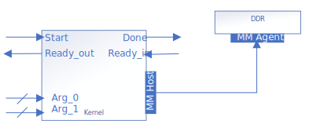

# Streaming Invocation and Conduit Arguments
This implementation uses a streaming invocation interface, and conduits to pass the input pointer arguments instead of the CSR. It uses a single, shared memory-mapped host data interface.
This design show how to specify conduit interfaces using `annotated_arg`.



## Invocation Interface - Streaming pipelined interface
In this design, the `SimpleVAdd` kernel uses a streaming pipelined invocation interface. This is explicitly specified using kernel properties. The following member function is added to the kernel functor to specify kernel properties:
```cpp
auto get(sycl::ext::oneapi::experimental::properties_tag) {
    return sycl::ext::oneapi::experimental::properties{
        sycl::ext::intel::experimental::streaming_interface<>,
        sycl::ext::intel::experimental::pipelined<1>
    };
}
```
The property `sycl::ext::intel::experimental::streaming_interface<>` configures a streaming invocation interface with a `ready_in` interface to allow down-stream components to backpressure. You can choose to remove the `ready_in` interface by using `sycl::ext::intel::experimental::streaming_interface_remove_downstream_stall` instead. If you omit this property, the compiler will configure your kernel with a register-mapped invocation interface.

The property `sycl::ext::intel::experimental::pipelined<1>` specifies that this streaming interface is pipelined with an II of 1. Other valid parameterization are:
- **-1**: Pipeline the kernel, and automatically infer lowest possible II at target fMAX.
- **0**: Do not pipeline the kernel.
- **N (N> 0)**: Pipeline the kernel, and force the II of the kernel to be N.
> **Note**: `sycl::ext::intel::experimental::pipelined<>` property only supports kernels with a streaming invocation interface.

Detailed explanation of invocation interfaces can be found in this dedicated [Invocation Interfaces](https://github.com/oneapi-src/oneAPI-samples/tree/master/DirectProgramming/C%2B%2BSYCL_FPGA/Tutorials/Features/experimental/invocation_interfaces) code sample.

## Data Interface
In this design, all kernel arguments (`A_in`, `B_in`, `C_out`, `len`) are implemented as conduits. In kernels with a streaming invocation interface, all unannotated arguments will be implemented as conduits by default. In kernels with a register-mapped invocation interface, all unannotated arguments will be implemented in the control/status register by default. In this design, they are explicitly specified as conduits to demonstrate the `annotated_arg` wrappers with property `sycl::ext::oneapi::experimental::conduit`.

Since `A_in`, `B_in` and `C_out` are pointers, they will share a Avalon memory-mapped host interface.

## Build the Design
This design supports four compilation options: Emulator, Simulator, Optimization Report, FPGA Hardware. For details on the different compilation options, see [fpga_compile](https://github.com/oneapi-src/oneAPI-samples/tree/master/DirectProgramming/C%2B%2BSYCL_FPGA/Tutorials/GettingStarted/fpga_compile) tutorial.

> **Note**: When working with the command-line interface (CLI), you should configure the oneAPI toolkits using environment variables. 
> Set up your CLI environment by sourcing the `setvars` script located in the root of your oneAPI installation every time you open a new terminal window. 
> This practice ensures that your compiler, libraries, and tools are ready for development.
>
> Linux*:
> - For system wide installations: `. /opt/intel/oneapi/setvars.sh`
> - For private installations: ` . ~/intel/oneapi/setvars.sh`
> - For non-POSIX shells, like csh, use the following command: `bash -c 'source <install-dir>/setvars.sh ; exec csh'`
>
> Windows*:
> - `C:\Program Files(x86)\Intel\oneAPI\setvars.bat`
> - Windows PowerShell*, use the following command: `cmd.exe "/K" '"C:\Program Files (x86)\Intel\oneAPI\setvars.bat" && powershell'`
>
> For more information on configuring environment variables, see [Use the setvars Script with Linux* or macOS*](https://www.intel.com/content/www/us/en/develop/documentation/oneapi-programming-guide/top/oneapi-development-environment-setup/use-the-setvars-script-with-linux-or-macos.html) or [Use the setvars Script with Windows*](https://www.intel.com/content/www/us/en/develop/documentation/oneapi-programming-guide/top/oneapi-development-environment-setup/use-the-setvars-script-with-windows.html).

### On Linux*

1. Change to the sample directory.
2. Configure the build system for the Agilex™ 7 device family, which is the default.

   ```
   mkdir build
   cd build
   cmake ..
   ```

   > **Note**: You can change the default target by using the command:
   >  ```
   >  cmake .. -DFPGA_DEVICE=<FPGA device family or FPGA part number>
   >  ``` 

3. Compile the design. (The provided targets match the recommended development flow.)

   1. Compile for emulation (fast compile time, targets emulated FPGA device).
      ```
      make fpga_emu
      ```

   2. Compile for simulation (fast compile time, targets simulator FPGA device):
      ```
      make fpga_sim
      ```

   3. Generate HTML performance report.
      ```
      make report
      ```
      The report resides at `vector_add.report.prj/reports/report.html`.

   4. Compile with Quartus place and route (To get accurate area estimate, longer compile time).
      ```
      make fpga
      ```

### On Windows*

1. Change to the sample directory.
2. Configure the build system for the Agilex™ 7 device family, which is the default.
   ```
   mkdir build
   cd build
   cmake -G "NMake Makefiles" ..
   ```

  > **Note**: You can change the default target by using the command:
  >  ```
  >  cmake -G "NMake Makefiles" .. -DFPGA_DEVICE=<FPGA device family or FPGA part number>
  >  ``` 

3. Compile the design. (The provided targets match the recommended development flow.)

   1. Compile for emulation (fast compile time, targets emulated FPGA device).
      ```
      nmake fpga_emu
      ```
   2. Compile for simulation (fast compile time, targets simulator FPGA device):
      ```
      nmake fpga_sim
      ```
   3. Generate HTML performance report.
      ```
      nmake report
      ```
      The report resides at `vector_add_report.a.prj/reports/report.html`.

   4. Compile with Quartus place and route (To get accurate area estimate, longer compile time).
      ```
      nmake fpga
      ```

>**Note**: If you encounter any issues with long paths when compiling under Windows*, you may have to create your ‘build’ directory in a shorter path, for example `C:\samples\build`. You can then run cmake from that directory, and provide cmake with the full path to your sample directory.

## Run the Design

### On Linux

#### Run on FPGA Emulator

1. Run the sample on the FPGA emulator (the kernel executes on the CPU).
   ```
   ./vector_add.fpga_emu
   ```

#### Run on FPGA Simulator

1. Run the sample on the FPGA simulator.
   ```
   CL_CONTEXT_MPSIM_DEVICE_INTELFPGA=1 ./vector_add.fpga_sim
   ```

### On Windows

#### Run on FPGA Emulator

1. Run the sample on the FPGA emulator (the kernel executes on the CPU).
   ```
   vector_add.fpga_emu.exe
   ```

#### Run on FPGA Simulator

1. Run the sample on the FPGA simulator.
   ```
   set CL_CONTEXT_MPSIM_DEVICE_INTELFPGA=1
   vector_add.fpga_sim.exe
   set CL_CONTEXT_MPSIM_DEVICE_INTELFPGA=
   ```

## Example Output

```
Add two vectors of size 256
PASSED
```

## License
Code samples are licensed under the MIT license. See
[License.txt](https://github.com/oneapi-src/oneAPI-samples/blob/master/License.txt) for details.

Third party program Licenses can be found here: [third-party-programs.txt](https://github.com/oneapi-src/oneAPI-samples/blob/master/third-party-programs.txt).